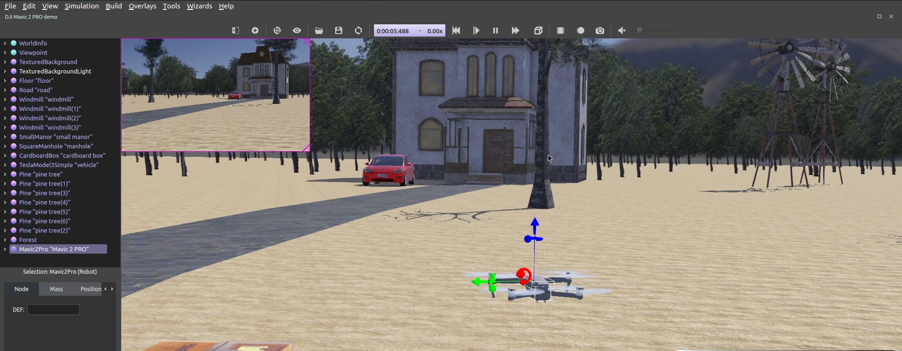
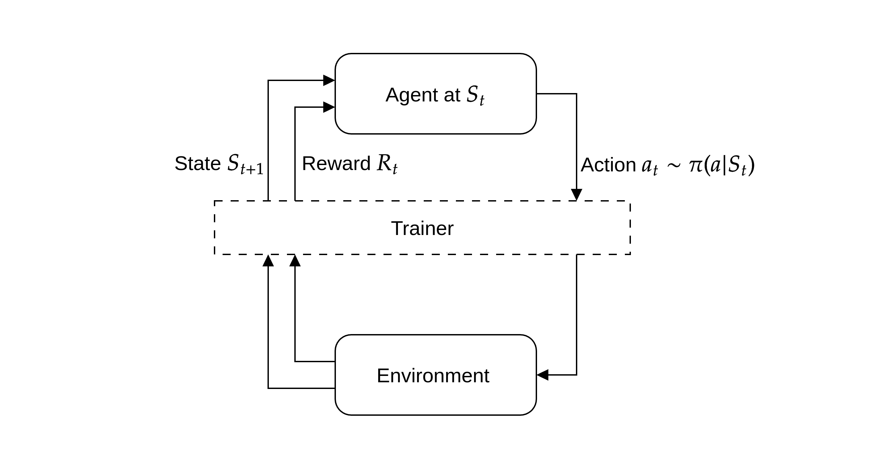

<!-- Back to top link:-->
<a name="readme-top"></a>

<!-- PROJECT LOGO -->
<br />
<div align="center">
  <a href="https://github.com/zivdar001matin/drl-drone-movement">
    
  </a>

<h3 align="center">drl-drone-movement</h3>

  <p align="center">
    A reinforcement learning approach to control your drone movement!
  </p>
</div>

<!-- TABLE OF CONTENTS -->
<details>
  <summary>Table of Contents</summary>
  <ol>
    <li>
      <a href="#about-the-project">About The Project</a>
      <ul>
        <li><a href="#built-with">Built With</a></li>
      </ul>
    </li>
    <li>
      <a href="#getting-started">Getting Started</a>
      <ul>
        <li><a href="#prerequisites">Prerequisites</a></li>
        <li><a href="#installation">Installation</a></li>
      </ul>
    </li>
    <li><a href="#usage">Usage</a></li>
    <li><a href="#roadmap">Roadmap</a></li>
    <li><a href="#contributing">Contributing</a></li>
    <li><a href="#license">License</a></li>
    <li><a href="#contact">Contact</a></li>
    <li><a href="#acknowledgments">Acknowledgments</a></li>
  </ol>
</details>

<!-- ABOUT THE PROJECT -->
## About The Project



Self-defined project for the final project of the [Deep Learning](https://github.com/SBU-CE/Deep-Learning) course at Shahid Beheshti University under the supervision of [Dr. Hamed Malek](https://scholar.google.com/citations?user=_IIio8oAAAAJ&hl=en). The aim of the project was to move a drone from point A to point B in real-time using reinforcement learning. The simulation was done in webots using [DJI' Mavic 2 PRO](https://www.cyberbotics.com/doc/guide/mavic-2-pro?version=R2021a#dji-mavic-2-pro).

<!-- <p align="right">(<a href="#readme-top">back to top</a>)</p> -->

### Built With

* Webots
* Kafka
* Docker

<p align="right">(<a href="#readme-top">back to top</a>)</p>


<!-- GETTING STARTED -->
## Getting Started

This is an example of how you can set up the project locally. 

The project has 3 main components:
- __webots__ folder is the same as the _environemt_ in the RL concept.
- __agents__ folder contains all the agents (random and dqn agents) which is as same as the _agent_ in the RL concept.
- __trainer.py__ is being used as a bridge between _evironment_ and _agent_, you may wonder why do we need it? Good question! In order to update our reinforcement learner.

<p>
  
  <em>Data pipeline is implemented using Kafka</em>
</p>

Each state is made up of these elements:
- position:
  - roll
  - pitch
  - altitude
- acceleration:
  - roll_acceleration
  - pitch_acceleration
- camera input (TODO)

Here is the main `trainer.py` code flow:
```python
def collect_gameplay_experience(self):
    """
    The collect_gameplay_experience function does the simulation "env" with the
    instructions produced by "agent" and stores the simulation experiences
    into "buffer" for later training.
    """
    env_json = self.get_state_from_env('reset')
    state = env_json['state']

    done = False
    while not done:
      # action = agent.policy(state)
      action = self.get_action_from_agent_policy(json.dumps(env_json))
      self.send_action_to_env(action)
      # next_state, reward, done = env.step(action)
      env_json = self.get_state_from_env('step')
      next_state = env_json['state']
      reward = env_json['reward']
      done = env_json['complete']
      if done:
        self.send_action_to_env('0')  #nop
      # store gameplay experience
      self.buffer.store_gameplay_experience(state, next_state, reward, action, done)
      state = next_state
```

### Prerequisites

First you have to install [Webots](https://cyberbotics.com/) which is an open source robot simulator we used for our simulation environment.

Because of the hassle with the Zookeeper and some other stuff, kafka was being run on docker using `spotify/kafka`. So it's necessary to install [Docker](https://docker.com/)! :)

### Setup

1. First we have to initialize the project structure  
   1.1 Clone the repo  
   ```shell
   git clone git@github.com:zivdar001matin/drl-drone-movement.git
   ```  
   1.2 To install the dependencies for the project  
    ```shell
    cd drl-drone-movement/
    conda env create --name drl-drone-movement --file environment.yml
    conda activate drl-drone-movement
    ```  
   1.3 Run 3 kafka containers each for each one of our main components kafka brokers.  
    ```shell
   # Agents
    docker run -p 2181:2181 -p 9092:9092 --name kafka-agents --env ADVERTISED_HOST=127.0.0.1 --env ADVERTISED_PORT=9092 spotify/kafka
    
    # Webots
    docker run -p 2182:2181 -p 9093:9092 --name kafka-webots --env ADVERTISED_HOST=127.0.0.1 --env ADVERTISED_PORT=9092 spotify/kafka
    
    # Trainer
    docker run -p 2183:2181 -p 9094:9092 --name kafka-trainer --env ADVERTISED_HOST=127.0.0.1 --env ADVERTISED_PORT=9092 spotify/kafka
        ```
2. Run your desired agent. (for example _dqn_agent_ is brought)
    ```sh
   python src/agents/dqn/dqn_agent.py
    ```
3. Now we have to setup the _webots_ for our environment.  
   3.1 In order to webots find the conda environment we should run our magical shell command!
    ```shell
   bash ./src/tools/update_webots_python_interpreter.sh
    ```
   3.2 Open `base_world.wbt` world in webots. If the simulation was running, stop it and revert it. (You can remove `--no-rendering` to see how does it move)
    ```sh
   webots --mode=fast --no-rendering base_world.wbt
    ```
7. Run the trianer to collect simulation experiences and do the RL training stuff. 
    ```sh
   python src/trainer.py
    ```
   
Below you can see a demo of a single train episode for the _dqn_agent_.


<p align="right">(<a href="#readme-top">back to top</a>)</p>

<!-- ROADMAP -->
## Roadmap

- [x] Set up interactions between all 3 components and use random agent
- [x] Use simple Deep Q-learning (DQN) agent
  - [x] Use drone states as agent states
  - [ ] Use drone camera alongside drone states as agent states
- [ ] Avoid obstacles in the environment
- [ ] Find a target in the environment by its given image

<p align="right">(<a href="#readme-top">back to top</a>)</p>

<!-- CONTRIBUTING -->
## Contributing

Contributions are what make the open source community such an amazing place to learn, inspire, and create. Any contributions you make are **greatly appreciated**.

If you have a suggestion that would make this better, please fork the repo and create a pull request. You can also simply open an issue with the tag "enhancement".
Don't forget to give the project a star! Thanks again!

1. Fork the Project
2. Create your Feature Branch (`git checkout -b feature/AmazingFeature`)
3. Commit your Changes (`git commit -m 'Add some AmazingFeature'`)
4. Push to the Branch (`git push origin feature/AmazingFeature`)
5. Open a Pull Request

<p align="right">(<a href="#readme-top">back to top</a>)</p>

<!-- LICENSE -->
## License

Distributed under the MIT License. See `LICENSE` for more information.

<p align="right">(<a href="#readme-top">back to top</a>)</p>


<!-- CONTACT -->
## Contact

Matin Zivdar - [@zivdar001matin](https://twitter.com/zivdar001matin)

Project Link: [https://github.com/zivdar001matin/drl-drone-movement](https://github.com/zivdar001matin/drl-drone-movement)

<p align="right">(<a href="#readme-top">back to top</a>)</p>
